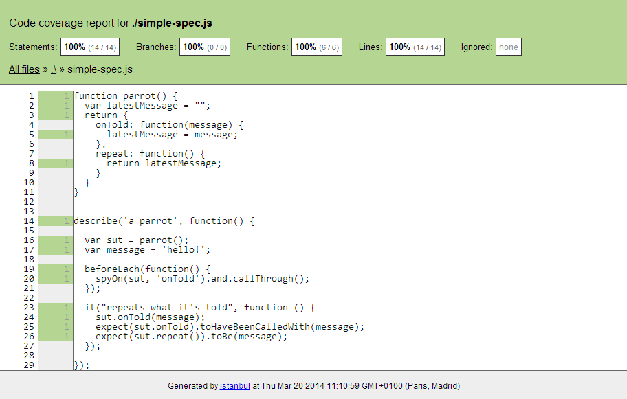

# Tests<br/>Qualimétrie

<!-- .slide: data-background="zenika/images/title-background.png" -->


## Plan

<!-- .slide: class="toc" -->

- [Build et génération du livrable](#/1)
- [Gestion des dépendances](#/2)
- **[Tests et qualimétrie](#/3)**
- [Productivité](#/4)
- [Intégration continue](#/5)
- [Debugging et optimisation](#/6)


## Objectifs

- Feedback rapide sur la fiabilité du code à tous les niveaux
  - Tests unitaires
  - Tests de bout-en-bout
  - Analyse statique
  - Calcul de la couverture


## Tests unitaires

<figure>
    
    <figcaption>Behavior-Driven Javascript</figcaption>
</figure>


## Jasmine

- http://jasmine.github.io/2.0

```javascript
describe('a parrot', function() {

  var sut = parrot();
  var message = 'hello!';

  it("repeats what it's told", function () {
    sut.onTold(message);
    expect(sut.repeat()).toBe(message);
  });
});
```

- Divers matchers : `toBeEqual`, `toContain`, `toBeLessThan`,
`toBeTruthy`... + matchers custom


## Setup & Teardown

```javascript
describe('a parrot', function() {

  var sut = parrot();
  var message = 'hello!';

  beforeEach(function() { 
    sut.onPet(); 
  });

  afterEach(function() { 
    sut.onFed(); 
  });

  it("repeats what it's told", function () {
    sut.onTold(message);
    expect(sut.repeat()).toBe(message);
  });

});
```


## Mocks / Spies

```javascript
describe('a parrot', function() {

  var sut = parrot();
  var message = 'hello!';

  beforeEach(function() { 
    spyOn(sut, 'onTold'); 
  });

  it("can be spied on", function () {
    sut.onTold(message);
    expect(sut.onTold).toHaveBeenCalledWith(message);
  });

});
```


## Lancer les tests

- Dans un navigateur
  - Ecrire une page HTML qui importe Jasmine, le code à tester, les tests
  - Ouvrir la page dans le navigateur de référence
  - Une telle page est fourni avec Jasmine, il faut simplement modifier les 
  `script[src]`
- Dans Node, à l'aide du projet `jasmine-node` (Jasmine 1.3)
  - `npm install -g jasmine-node`
  - `jasmine-node <fichiers/dossiers de tests>`


## Alternatives

- [Mocha](http://visionmedia.github.io/mocha/)
  - API très proche de Jasmine
  - Conçu pour Node mais supporte les navigateurs
  - Plus flexible mais plus difficile à appréhender (pas d'API d'assert ni de
  mock embarquées)
- [QUnit](https://qunitjs.com/)
  - API standard xUnit
  - Conçu pour les navigateurs, peut fonctionner sous Node avec à l'aide de
  projets tierce-partie


## Automatisation des tests unitaires

<figure>
    
    <figcaption>Spectacular Test Runner for Javascript</figcaption>
</figure>


## Karma

- Créé par l'équipe AngularJS
- Tourne sur Node
- Il exécute atuomatiquement les tests
  - dans plusieurs navigateurs
  - à chaque modification du code
- Indépendant du framework de test
  - Compatible Jasmine, Mocha, QUnit et autres


## Installation
- `npm install -g karma-cli`
- `npm install karma` + les plugins voulus
  - `karma-jasmine`
  - `karma-firefox-launcher`
  - ...
- `karma init` crée un fichier de configuration `karma.conf.js` interactivement
- `karma start` lance Karma en continue
  - ajouter l'option `--single-run` pour passer les tests une fois


## Exemple de karma.conf.js

```javascript
module.exports = function(config) {
  config.set({
    frameworks: ['jasmine'], 

    files: [ // Inclus le code à tester
      'src/*.js',
      'test/*.js',
    ],

    browsers: ['Chrome', 'Firefox'],

    // Relancer les tests à chaque modification d'un fichier
    autoWatch: true, 

    // Une seule passe de test
    singleRun: false,
  });
};
```


## Couverture de test

- `npm install karma-coverage`

```javascript
module.exports = function(config) {
  config.set({

    /* ... */

    preprocessors: {
      "*.js": ['coverage'],
    },

    reporters: ['coverage'],

  });
};
```


## Couverture de test




## Tests bout-en-bout

<figure>
    
    <figcaption>Protractor: E2E test framework for Angular apps</figcaption>
</figure>


## Protractor

- Créé par l'équipe AngularJS
- Tourne sur Node
- Basé sur Selenium
  - Tests par automation du navigateur
  - Nécessite un serveur Selenium
  - Reprend le style de l'API Selenium en ajoutant des spécificités Angular
- API pour les tests : Jasmine ou Mocha


## Mise en route

- `npm install -g protractor`
- `webdriver-manager update` + `webdriver-manager start` pour installer et
lancer un serveur Selenium
- `protractor protractor.conf.js`

```javascript
exports.config = {
  seleniumAddress: 'http://localhost:4444/wd/hub',
  capabilities: {
    'browserName': 'firefox'
  },
  specs: ['spec.js'],
};
```


## Exemple de test

```javascript
describe('angularjs homepage', function() {

  it('should greet the named user', function() {
    browser.get('http://www.angularjs.org');

    // Cherche les input avec ng-model=yourName
    element(by.model('yourName')).sendKeys('Zenika');

    // Cherche les éléments bindés à yourName
    // Exemple : <h1>Hello \{{yourName}}</h1>
    var greeting = element(by.binding('yourName'));

    expect(greeting.getText()).toEqual('Hello Zenika!');
  });

});
```


<!-- .slide: data-background="zenika/images/questions.png" -->
<!-- .slide: data-background-size="30%" -->