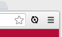

# Productivité

<!-- .slide: data-background="zenika/images/title-background.png" -->


## Plan

<!-- .slide: class="toc" -->

- [Build et génération du livrable](#/1)
- [Gestion des dépendances](#/2)
- [Tests et qualimétrie](#/3)
- **[Productivité](#/4)**
- [Intégration continue](#/5)
- [Debugging et optimisation](#/6)


## LiveReload

<figure>
    
    <figcaption>A happy land where browsers don't need a Refresh button.</figcaption>
</figure>


## Fonctionnement

- Un serveur surveille des fichiers et envoie des notifications à tous les
clients connectés quand l'un d'eux est modifié.
- Le serveur peut être :
  - Une application avec GUI : http://livereload.com/
  - Une application en ligne de commande : `guard-livereload`
  - Un éditeur de texte
  - Un outil de build : `grunt-contrib-watch`
- Le client prend la forme d'un plugin pour navigateur qui rafraichit la page à
chaque notification reçue


## Configuration de Grunt

- `npm install grunt-contrib-watch`

```javascript
watch: {
  options: {
    livereload: true,
  },
  assets: {
    files: ['assets/**'],
    tasks: ['copy:assets'],
  },
}
```

```dos
grunt watch
```

- Attention : `watch` est une tâche bloquante, elle doit donc être la dernière
tâche dans une suite de tâche

Notes :
- `files` : fichiers à surveiller
- `tasks` : tâches à exécuter à chaque modification des fichiers


## Côté navigateur

- Extensions Firefox et Safari disponibles sur livereload.com
  - Pas d'accès aux fichiers locaux pour Safari
- Extension Chrome [LiveReload](https://chrome.google.com/webstore/detail/livereload/jnihajbhpnppcggbcgedagnkighmdlei) 
sut le Chrome Web Store
  - Cocher *Autoriser l'accès aux URL de fichier* dans les paramètres de
  l'extension pour pouvoir l'utiliser avec des fichiers locaux
  - Il faut activer l'extension en cliquant dessus pour chaque page que l'on veut voir rechargée




## Les méta-langages

- Méta-langages Javascript
  - *CoffeeScript*
  - *TypeScript*
  - Dart
- Méta-langages CSS
  - *Sass*
  - Less


## CoffeeScript

- http://coffeescript.org/
- Amélioration syntaxique du Javascript
- Accès à tout l'écosystème JS
- Se compile en du Javascript lisible


## CoffeeScript 

- `var` ainsi que certaines parenthèses, accolades et virgules sont 
optionnels

```coffeescript
newObj = Object.create 'CoffeeScript'
```
```coffeescript
computer = 
    vendor: 'Zenika'
    cpu: 3200
    ram: 8192
```

- Tout est expression

```coffeescript
hour24 = if ampm is 'AM' then hour12 else hour12 + 12
```


## CoffeeScript 

- Opérateur d'existence

```coffeescript
if WebSockets?
```

- Notation raccourci pour les fonctions

```coffeescript
square = (x) -> x * x
```

- Interpolation (double quotes seulement)

```coffeescript
fruits = 'fraises'
print "les #{fruits} sont de saison !"
```


## CoffeeScript

- Classes et héritage

```coffeescript
class Animal
  constructor: (@name) ->

  move: (meters) ->
    alert @name + " moved #{meters}m."

class Snake extends Animal
  move: ->
    alert "Slithering..."
    super 5
```


## CoffeeScript 

- List comprehensions et intervalles

```coffeescript
x * x for x in [0..10]
```

- Beaucoup d'autres facilités de syntaxe
  - `yes`/`no`, `on`/`off` équivalents à `true`/`false`
  - `and`, `or` et `not` au lieu de `&&`, `||` et `!`
  - `unless` plutôt que `if not`
  - `==` et `!=` sont traduit en `===` et `!==`
  - Possible d'intégrer du Javascript entre backticks


## TypeScript

- http://www.typescriptlang.org
- Un Javascript avec typage optionnel
- Sur-ensemble de Javascript
  - Tout code Javscript est un code TypeScript


## TypeScript

- Typage des paramètres

```typescript
function greeter(person: string) {
    return "Hello, " + person;
}
```

- Interface

```typescript
interface Person {
    firstname: string;
    lastname: string;
}
```


## TypeScript

- Classes

```typescript
class Greeter {
  greeting: string;
  constructor(message: string) {
    this.greeting = message;
  }
  greet() {
    return "Hello, " + this.greeting;
  }
}

var greeter = new Greeter("world");
```


## Sass

- http://sass-lang.com
- Syntactically Awesome Style Sheets


## Sass

- Variales

```sass
$font-stack:    Helvetica, sans-serif
$primary-color: #333

body
  font: 100% $font-stack
  color: $primary-color
```


## Sass

- Mixins

```sass
@mixin border-radius($radius) {
  -webkit-border-radius: $radius;
     -moz-border-radius: $radius;
      -ms-border-radius: $radius;
          border-radius: $radius;
}

.box { @include border-radius(10px); }
```


## Sass

- Nesting

```sass
nav
  ul
    margin: 0
    padding: 0
    list-style: none

  li
    display: inline-block

  a
    display: block
    padding: 6px 12px
    text-decoration: none
```


## Sass

- Héritage

```sass
.message
  border: 1px solid #ccc
  padding: 10px
  color: #333

.success
  @extend .message
  border-color: green
```

Notes :
- Le CSS généré :

```css
.message .success {
  border: 1px solid #ccc;
  padding: 10px;
  color: #333;
}

.success {
  border-color: green;
}
```


<!-- .slide: data-background="zenika/images/questions.png" -->
<!-- .slide: data-background-size="30%" -->


<!-- .slide: data-background="zenika/images/tp4.png" -->
<!-- .slide: data-background-size="30%" -->