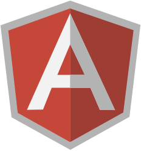

# Tests<br/>Qualimétrie

<!-- .slide: data-background="zenika/images/title-background.png" -->


## Plan

- Build et génération du livrable
- Gestion des dépendances
- **Tests et qualimétrie**
- Productivité
- Intégration continue
- Debugging et optimisation


## Objectifs

- Feedback rapide sur la fiabilité du code à tous les niveaux
  - Tests unitaires
  - Tests de bout-en-bout
  - Analyse statique
  - Calcul de la couverture


## Tests unitaires

<figure>
    
</figure>


## Jasmine

- http://jasmine.github.io/2.0

```javascript
describe('a parrot', function() {

  var sut = parrot();
  var message = 'hello!';

  it("repeats what it's told", function () {
    sut.onTold(message);
    expect(sut.repeat()).toBe(message);
  });
});
```

- Divers matchers : `toBeEqual`, `toContain`, `toBeLessThan`,
`toBeTruthy`... + matchers custom


## Setup & Teardown

```javascript
describe('a parrot', function() {

  var sut = parrot();
  var message = 'hello!';

  beforeEach(function() { 
    sut.onPet(); 
  });

  afterEach(function() { 
    sut.onFed(); 
  });

  it("repeats what it's told", function () {
    sut.onTold(message);
    expect(sut.repeat()).toBe(message);
  });

});
```


## Mocks / Spies

```javascript
describe('a parrot', function() {

  var sut = parrot();
  var message = 'hello!';

  beforeEach(function() { 
    spyOn(sut, 'onTold'); 
  });

  it("repeats what it's told", function () {
    sut.onTold(message);
    expect(sut.onTold).toHaveBeenCalledWith(message);
  });

});
```


## Lancer les tests

- Dans un navigateur
  - Ecrire une page HTML qui importe Jasmine, le code à tester, les tests
  - Ouvrir la page dans le navigateur de référence
  - Une telle page est fourni avec Jasmine, il faut simplement modifier les 
  `script[src]`
- Dans Node, à l'aide du projet `jasmine-node`
  - `npm install -g jasmine-node`
  - `jasmine-node <dossier de tests>`


## Alternatives

- [Mocha](http://visionmedia.github.io/mocha/)
  - API très proche de Jasmine
  - Conçu pour Node mais supporte les navigateurs
  - Plus flexible mais plus difficile à appréhender (pas d'API d'assert ni de
  mock embarquées)
- [QUnit](https://qunitjs.com/)
  - API standard xUnit
  - Conçu pour les navigateurs, peut fonctionner sous Node avec à l'aide de
  projets tierce-partie


## Tests bout-en-bout

<figure>
    
    <figcaption>Protractor: E2E test framework for Angular apps</figcaption>
</figure>


## Protractor

- Créé par l'équipe AngularJS
- Tourne sur Node
- Basé sur Selenium
  - Tests par automation du navigateur
  - Nécessite un serveur Selenium
  - Reprend le style de l'API Selenium en ajoutant des spécificités Angular
- API pour les tests : Jasmine ou Mocha


## Mise en route

- `npm install -g protractor`
- `webdriver-manager update` + `webdriver-manager start` pour installer et
lancer un serveur Selenium
- `protractor conf.js`

```javascript
exports.config = {
  seleniumAddress: 'http://localhost:4444/wd/hub',
  capabilities: {
    'browserName': 'firefox'
  },
  specs: ['spec.js'],
};
```


## Exemple de test

```javascript
describe('angularjs homepage', function() {

  it('should greet the named user', function() {
    browser.get('http://www.angularjs.org');

    // Cherche les input avec ng-model=yourName
    element(by.model('yourName')).sendKeys('Zenika');

    // Cherche les éléments bindés à yourName
    // Exemple : <h1>Hello \{{yourName}}</h1>
    var greeting = element(by.binding('yourName'));

    expect(greeting.getText()).toEqual('Hello Zenika!');
  });

});
```


<!-- .slide: data-background="zenika/images/questions.png" -->
<!-- .slide: data-background-size="30%" -->