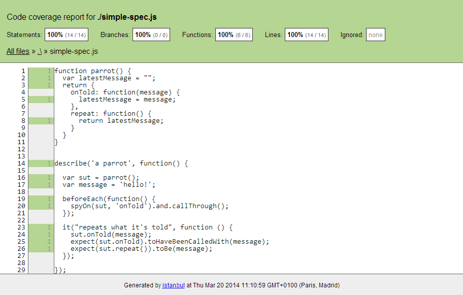

# Tests<br/>Qualimétrie

<!-- .slide: data-background="zenika/images/title-background.png" -->


## Plan

<!-- .slide: class="toc" -->

- [Introduction à l'industrialisation](#/1)
- [Build & Run](#/2)
- [Optimisation du livrable](#/3)
- [Gestion des dépendances](#/4)
- **[Tests et qualimétrie](#/5)**
- [Productivité](#/6)
- [Intégration continue](#/7)
- [Debugging et optimisation](#/8)


## Objectifs

- Feedback rapide sur la fiabilité du code à tous les niveaux
  - Analyse statique
  - Tests unitaires
  - Tests d'intégration
  - Tests de bout-en-bout
  - Calcul de la couverture

Notes :
- Ce qu'on entend par "tests d'intégration" ici, ce sont plusieurs composants
ensemble, avec éventuellement des ressources extérieures comme une base de
données.


## Analyse statique

<figure>
    
</figure>


## JSHint

- http://jshint.com
  - Analyse possible directement sur le site
- Fork de [JSLint](http://www.jslint.com/) de Douglas Crockford
- Recherche les erreurs
- Fait des remarques de styles
- Complètement configurable
- Installable avec NPM
  - `npm install -g jshint`
  - `jshint <fichier.js>`


## Exemple

```javascript
function une_accolade_par_là() {
  une_autre_variable = 2 * variable
  var variable = 0
  la_même = '' || [];
  if (variable == la_même) return undefined
  consle.log("que dit jshint ?")
  return 1
}

function une_accolade_par_ci()
{
  return
  {
    un: 'objet,'
    bien: 'rempli'
  }
}

console.log(une_accolade_par_ci())
console.log(une_accolade_par_là())
```

<!-- .element: class="fragment alert alert-success" style="position: absolute; top: 125px; right: 10px; width: 360px;" -->
On l'envoit en production ?

<!-- .element: class="fragment alert alert-info" style="position: absolute; top: 195px; right: 10px; width: 360px;" -->
Ce code s'exécute sans erreurs !<br/> Il affiche `undefined` deux fois.

<!-- .element: class="fragment alert alert-warning" style="position: absolute; top: 295px; right: 10px; width: 360px;" -->
Qu'en dit JSHint ?

<!-- .element: class="fragment alert alert-danger" style="position: absolute; top: 365px; right: 10px; width: 360px;" -->
Var. utilisée avant sa déclaration

<!-- .element: class="fragment alert alert-danger" style="position: absolute; top: 435px; right: 190px; width: 180px;" -->
`var` qui manque

<!-- .element: class="fragment alert alert-danger" style="position: absolute; top: 435px; right: 10px; width: 140px;" -->
`==` douteux

<!-- .element: class="fragment alert alert-danger" style="position: absolute; top: 505px; right: 10px; width: 360px;" -->
Faute de frappe

<!-- .element: class="fragment alert alert-danger" style="position: absolute; top: 575px; right: 10px; width: 360px;" -->
Retour à la ligne malencontreux

Notes :
- Cette slide contient des fragments qui vont apparaitre au fur et à mesure.
- Les fragments n'apparaissent pas sur les slides papier des participants,
il peut donc être intéressant de leur demander de prendre des notes.
- Demander aux staigaires ce qu'ils pensent que le code va faire. Tomber en
erreur ? Afficher quelque chose dans la console ?
- Afficher le premier fragment et demander si on l'envoit en production.
- Ensuite, dérouler les fragments
- Les `var` qui manquent devant `une autre variable` et `la_même` rendent ces
variables globales
- `variable` est déclarée après son utilisation, et est donc `undefined` à ce
moment là, mais l'interpréteur n'a pas de problème pour calculer
`2 * undefined` (ça retourne `undefined`)
- Le `==` retourne `true` quand il compare `0` et `[]` car ces deux valeurs
sont équivalentes à faux.
- `console` est mal orthographié mais il n'y a pas d'erreur parce que cette ligne n'est jamais exécutée
- A cause du retour à la ligne après `return`, l'interpréteur insère un
point-virgule et la fonction retourne `undefined`. L'objet qui suit est
ignoré et les erreurs de syntaxe qu'il contient aussi.


## Règles

- Liste des règles : http://jshint.com/docs/options
- Toutes (dés)activables
- Configuration pour un projet à écrire dans un fichier JSON nommé `.jshintrc`
  - Il est possible de mettre un de ces fichiers dans un sous-dossier, et il
  surchargera les options du fichier parent

```json
{
  "browser": true,
  "asi": false,
  "laxbreak": false,
  ...
}
```

Notes :
- `brower` : le script s'exécutera dans le navigateur (`window` est disponible
globalement).
- `asi` : Automatic Semi-colon Insertion, autorise l'oubli de points-virgules.
- `laxbreak` : autorise les retours à la ligne qui pourrait poser problème
(notamment après `return` comme vu slide précédente).


## Intégration avec Grunt

- Plugin `grunt-contrib-jshint`

```javascript
jshint: {

  options: {
    curly: true, // forcer les accolades
    eqeqeq: true, // forcer ===
    /* ... */
  },

  src: ['src/**/*.js'],
  test: ['test/**/*.js'],
},
```

- option `jshintrc: true` pour externaliser les règles


## Intégration aux éditeurs de texte

- Plugin pour de nombreux éditeurs
  - Notepad++, Gedit
  - Sublime Text, TextMate
  - Vim, Emacs
  - Visual Studio, Eclipse
  - IntelliJ, WebStorm (intégré en standard)


## Tests

<figure>
    
    <figcaption>Behavior-Driven Javascript</figcaption>
</figure>


## Jasmine

- http://jasmine.github.io/2.0

```javascript
describe('a parrot', function() {

  var sut = parrot();
  var message = 'hello!';

  it("repeats what it's told", function () {
    sut.onTold(message);
    expect(sut.repeat()).toBe(message);
  });
});
```

- Divers matchers : `toBeEqual`, `toContain`, `toBeLessThan`,
`toBeTruthy`... + matchers custom

Notes :
- L'exemple décrit un perroquet qui dispose d'une méthode `onTold` pour lui
parler et d'une méthode `repeat` pour lui faire répéter ce qu'on lui a dit. Le
test vérifie simplement que ce qu'il répète est bien ce qu'on lui a dit.
- Si les participants sont Java-istes : `describe` correspond à une classe,
`it` à une méthode.


## Setup & Teardown

```javascript
describe('a parrot', function() {

  var sut = parrot();
  var message = 'hello!';

  beforeEach(function() {
    sut.onPet();
  });

  afterEach(function() {
    sut.onFed();
  });

  it("repeats what it's told", function () {
    sut.onTold(message);
    expect(sut.repeat()).toBe(message);
  });

});
```

Notes :
- "on pet" veut dire qu'on carresse le perroquet
- "on fed" veut dire qu'on nourrit le perroquet


## Mocks / Spies

```javascript
describe('a parrot', function() {

  var sut = parrot();
  var message = 'hello!';

  beforeEach(function() {
    spyOn(sut, 'onTold');
  });

  it("can be spied on", function () {
    sut.onTold(message);
    expect(sut.onTold).toHaveBeenCalledWith(message);
  });

});
```


## Lancer les tests

- Dans un navigateur
  - Ecrire une page HTML qui importe Jasmine, le code à tester, les tests
  - Ouvrir la page dans le navigateur de référence
  - Une telle page est fourni avec Jasmine, il faut simplement modifier les
  `script[src]`
- Dans Node, à l'aide du projet `jasmine-node`
  - `npm install -g jasmine-node`
  - `jasmine-node <fichiers/dossiers de tests>`
  - Intégrable avec Grunt


## Alternatives

- [Mocha](http://visionmedia.github.io/mocha/)
  - API très proche de Jasmine
  - Conçu pour Node mais supporte les navigateurs
  - Plus flexible mais plus difficile à appréhender (pas d'API d'assert ni de
  mock embarquées)
- [QUnit](https://qunitjs.com/)
  - API standard xUnit
  - Conçu pour les navigateurs, peut fonctionner sous Node avec à l'aide de
  projets tierce-partie


## Automatisation des tests unitaires

<figure>
    
    <figcaption>Spectacular Test Runner for Javascript</figcaption>
</figure>


## Karma

- Module Node créé par l'équipe AngularJS
- Il exécute atuomatiquement les tests
  - dans plusieurs navigateurs
  - à chaque modification du code
- Indépendant du framework de test
  - Compatible Jasmine, Mocha, QUnit et autres


## Installation
- `npm install -g karma-cli`
- `npm install karma` + les plugins voulus
  - `karma-jasmine`
  - `karma-firefox-launcher`
  - ...
- `karma init` crée un fichier de configuration `karma.conf.js` interactivement
- `karma start` lance Karma en continue
  - ajouter l'option `--single-run` pour passer les tests une fois


## Exemple de karma.conf.js

```javascript
module.exports = function(config) {
  config.set({
    frameworks: ['jasmine'],

    files: [ // Inclus le code à tester
      'src/*.js',
      'test/*.js',
    ],

    browsers: ['Chrome', 'Firefox'],

    // Relancer les tests à chaque modification d'un fichier
    autoWatch: true,

    // Une seule passe de test
    singleRun: false,
  });
};
```


## Couverture de test

- `npm install karma-coverage`

```javascript
module.exports = function(config) {
  config.set({

    /* ... */

    preprocessors: {
      "*.js": ['coverage'],
    },

    reporters: ['coverage'],

  });
};
```


## Couverture de test




## Webdriver I/O

<figure>
  
  <figcaption>Selenium 2.0 bindings for NodeJS</figcaption>
</figure>


## Webdriver I/O

- http://www.webdriver.io/
- API fluent JavaScript pour piloter Selenium

```js
webdriverio
    .remote(options)
    .init()
    .url('http://www.google.com')
    .setValue('input[name="q"]', 'randomness\n')
    .waitFor('div.rc a', 5000)
    .click('div.rc a')
    .title(function(err, res) {
        console.log('Title was: ' + res.value);
    })
    .end();
```


<!-- .slide: data-background="zenika/images/questions.png" -->
<!-- .slide: data-background-size="30%" -->


<!-- .slide: data-background="zenika/images/tp4.png" -->
<!-- .slide: data-background-size="30%" -->
