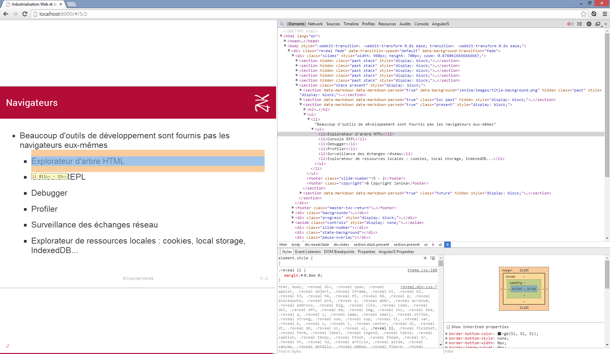
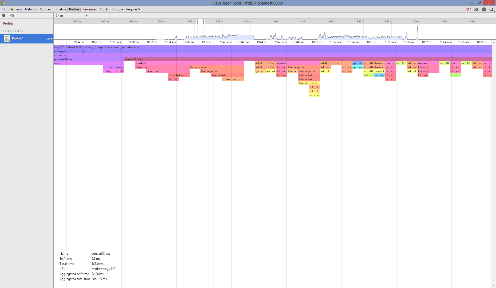
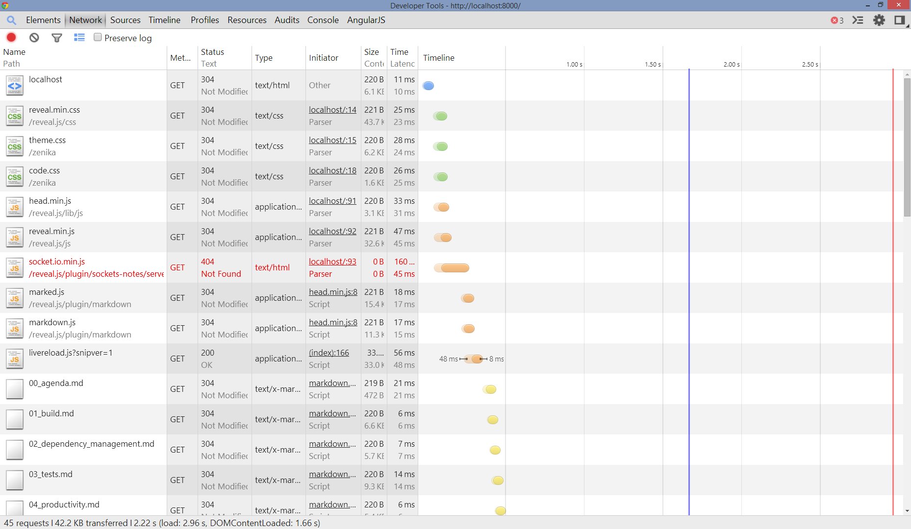

# Debugging et Optimisation

<!-- .slide: data-background="zenika/images/title-background.png" -->

## Plan

<!-- .slide: class="toc" -->

- [Build et génération du livrable](#/1)
- [Gestion des dépendances](#/2)
- [Tests et qualimétrie](#/3)
- [Productivité](#/4)
- [Intégration continue](#/5)
- **[Debugging et optimisation](#/6)**

## Navigateurs

- Beaucoup d'outils de développement sont fournis pas les navigateurs eux-mêmes
  - Explorateur d'arbre HTML
  - Console REPL
  - Debugger
  - Profiler
  - Surveillance des échanges réseau
  - Explorateur de ressources locales : cookies, local storage, IndexedDB...

## Explorateur d'arbre HTML

- Trouver à quelle balise correspond un fragment de page ou vice-versa
- Editer le HTML en live
- Trouver quelles régles CSS s'appliquent sur un élément
- Visualiser les marges, paddings et autres distances CSS
- Editer le CSS en live
- Lister les évènements attachés à un élément

## Explorateur d'arbre HTML dans Chrome 35

## Console REPL

- Afficher les erreurs émises par l'interpréteur
- Afficher les logs : `console.log`, `console.warn`, ...
- Tester des expressions Javascript

## Debugger

- Exécuter le code pas à pas
- Examiner la valeur des variables
- Explorer la pile d'exécution

## Debugger dans Chrome 35

## Profiler

- Mesurer les performances
- Trouver les goulots d'étranglement
- Auditer le code
  - Détecter des problèmes de performances communs

## Profiler dans Chrome 35

## Audits dans Chrome 35

## Surveillance du réseau

- Vérifier que des échanges ont bien lieu
- Vérifier le contenu des échanges
- Détecter les échanges longs
- Visualiser l'ensemble des échanges dans le temps

## Surveillance du réseau dans Chrome 35

