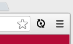
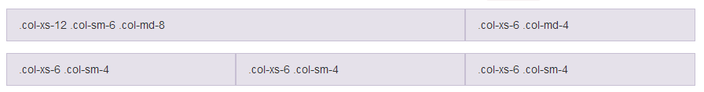
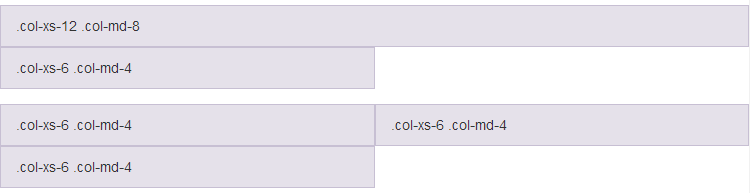
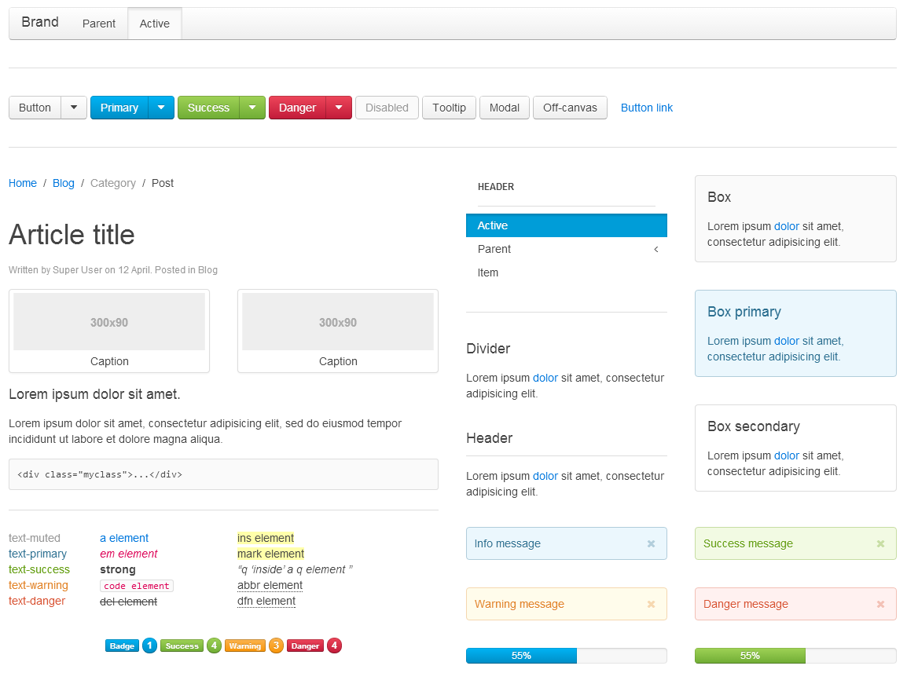
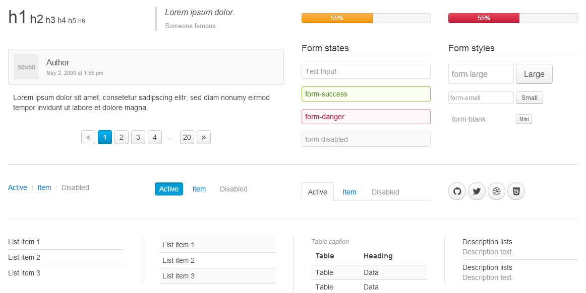

# Productivité

<!-- .slide: data-background="zenika/images/title-background.png" -->


## Plan

<!-- .slide: class="toc" -->

- [Introduction à l'industrialisation](#/1)
- [Build & Run](#/2)
- [Optimisation du livrable](#/3)
- [Gestion des dépendances](#/4)
- [Tests et qualimétrie](#/5)
- **[Productivité](#/6)**
- [Intégration continue](#/7)
- [Debugging et optimisation](#/8)


## LiveReload

<figure>
    
    <figcaption>A happy land where browsers don't need a Refresh button.</figcaption>
</figure>


## Fonctionnement

- Un serveur surveille des fichiers et envoie des notifications à tous les
clients connectés quand l'un d'eux est modifié.
- Le serveur peut être :
  - Une application avec GUI : http://livereload.com/
  - Une application en ligne de commande : `guard-livereload`
  - Un éditeur de texte
  - Un outil de build : `grunt-contrib-watch`
- Le client prend la forme d'un plugin pour navigateur qui rafraichit la page à
chaque notification reçue


## Configuration de Grunt

- `npm install grunt-contrib-watch`

```javascript
watch: {
  options: {
    livereload: true,
  },
  assets: {
    files: ['assets/**'],
    tasks: ['copy:assets'],
  },
}
```

```dos
grunt watch
```

- Attention : `watch` est une tâche bloquante, elle doit donc être la dernière
tâche dans une suite de tâche

Notes :
- `files` : fichiers à surveiller
- `tasks` : tâches à exécuter à chaque modification des fichiers


## Côté navigateur

- Extensions Firefox et Safari disponibles sur livereload.com
  - Pas d'accès aux fichiers locaux pour Safari
- Extension Chrome [LiveReload](https://chrome.google.com/webstore/detail/livereload/jnihajbhpnppcggbcgedagnkighmdlei)
sut le Chrome Web Store
  - Cocher *Autoriser l'accès aux URL de fichier* dans les paramètres de
  l'extension pour pouvoir l'utiliser avec des fichiers locaux
  - Il faut activer l'extension en cliquant dessus pour chaque page que l'on veut voir rechargée




## Frameworks CSS

- Ces framework proposent
  - Un système de grille responsive pour la mise en page
  - Des styles pour le typographie
  - Des composants préparés (boutons, onglets...)
- Le plus populaire : Bootstrap
  - http://getbootstrap.com
- Des challengers : Foundation, UI Kit, ...


## Grille responsive Bootstrap

- Grille à 12 colonnes
- S'il y a plus de 12 colonnes, le contenu passent à la ligne
- Du contenu peut prendre un nombre différent de colonnes dépendant de la largeur de l'écran
- Bootstrap divise les tailles d'écran en 4 catégories
  - `xs` en-dessous de 768px exclus
  - `sm` en-dessous de 992px exclus
  - `md` en-dessous de 1200px exclus
  - `lg` au-dessus de 1200px inclus


## Grille responsive Bootstrap : exemple

```html
<div class="row">
  <div class="col-xs-12 col-sm-6 col-md-8"></div>
  <div class="col-xs-6 col-md-4"></div>
</div>
<div class="row">
  <div class="col-xs-6 col-sm-4"></div>
  <div class="col-xs-6 col-sm-4"></div>
  <div class="col-xs-6 col-sm-4"></div>
</div>
```


## Grille responsive Bootstrap : exemple

<figure>
  
  <figcaption>Vue sur un écran large (PC)</figcaption>
</figure>

<figure>
  
  <figcaption>Vue sur un écran étroit (téléphone)</figcaption>
</figure>


## Composants UI Kit




## Composants UI Kit




## Les méta-langages

- Méta-langages JavaScript
  - CoffeeScript
  - TypeScript
  - Dart
- Méta-langages CSS
  - Sass
  - Less


## CoffeeScript

- http://coffeescript.org/
- Amélioration syntaxique du JavaScript
- Accès à tout l'écosystème JS
- Se compile en du JavaScript lisible


## CoffeeScript

- `var` ainsi que certaines parenthèses, accolades et virgules sont
optionnels

```coffeescript
newObj = Object.create 'CoffeeScript'
```
```coffeescript
computer =
    vendor: 'Zenika'
    cpu: 3200
    ram: 8192
```

- Tout est expression

```coffeescript
hour24 = if ampm is 'AM' then hour12 else hour12 + 12
```


## CoffeeScript

- Opérateur d'existence

```coffeescript
if WebSockets?
```

- Notation raccourci pour les fonctions

```coffeescript
square = (x) -> x * x
```

- Interpolation (double quotes seulement)

```coffeescript
fruits = 'fraises'
print "les #{fruits} sont de saison !"
```


## CoffeeScript

- Classes et héritage

```coffeescript
class Animal
  constructor: (@name) ->

  move: (meters) ->
    alert @name + " moved #{meters}m."

class Snake extends Animal
  move: ->
    alert "Slithering..."
    super 5
```


## CoffeeScript

- List comprehensions et intervalles

```coffeescript
x * x for x in [0..10]
```

- Beaucoup d'autres facilités de syntaxe
  - `yes`/`no`, `on`/`off` équivalents à `true`/`false`
  - `and`, `or` et `not` au lieu de `&&`, `||` et `!`
  - `unless` plutôt que `if not`
  - `==` et `!=` sont traduit en `===` et `!==`
  - Possible d'intégrer du JavaScript entre backticks


## TypeScript

- http://www.typescriptlang.org
- Un JavaScript avec typage optionnel
- Sur-ensemble de JavaScript
  - Tout code Javscript est un code TypeScript


## TypeScript

- Typage des paramètres

```typescript
function greeter(person: string) {
    return "Hello, " + person;
}
```

- Interface

```typescript
interface Person {
    firstname: string;
    lastname: string;
}
```


## TypeScript

- Classes

```typescript
class Greeter {
  greeting: string;
  constructor(message: string) {
    this.greeting = message;
  }
  greet() {
    return "Hello, " + this.greeting;
  }
}

var greeter = new Greeter("world");
```


## Dart

- Nouveau langage developpé par Google
- Client ou serveur
- Compilation vers JavaScript
- Outillage
  - IDE
  - Package Manager
- Port des frameworks Google
  - Polymer
  - Angular


## Dart

- Typage optionnel
- Classes, interfaces, héritage, modules...

```dart
int fib(int n) => (n > 1) ? (fib(n - 1) + fib(n - 2)) : 1;

void main() {
    print('fib(20) = ${fib(20)}');
}
```


## Dart

```dart
import 'dart:math' as math;
class Point {
    final num x, y;

    Point(this.x, this.y);
    Point.origin() : x = 0, y = 0;

    num distanceTo(Point other) {
        var dx = x - other.x;
        var dy = y - other.y;
        return math.sqrt(dx * dx + dy * dy);
    }
}

void main() {
    var p1 = new Point(10, 10);
    var p2 = new Point.origin();
    var distance = p1.distanceTo(p2);
    print(distance);
}
```


## Sass

- http://sass-lang.com
- Syntactically Awesome Style Sheets
- Concurrent très proche : LESS (http://lesscss.org/)


## Sass

- Variales

```sass
$font-stack:    Helvetica, sans-serif
$primary-color: #333

body
  font: 100% $font-stack
  color: $primary-color
```


## Sass

- Mixins

```sass
@mixin border-radius($radius) {
  -webkit-border-radius: $radius;
     -moz-border-radius: $radius;
      -ms-border-radius: $radius;
          border-radius: $radius;
}

.box { @include border-radius(10px); }
```


## Sass

- Nesting

```sass
nav
  ul
    margin: 0
    padding: 0
    list-style: none

  li
    display: inline-block

  a
    display: block
    padding: 6px 12px
    text-decoration: none
```


## Sass

- Héritage

```sass
.message
  border: 1px solid #ccc
  padding: 10px
  color: #333

.success
  @extend .message
  border-color: green
```

Notes :
- Le CSS généré :

```css
.message .success {
  border: 1px solid #ccc;
  padding: 10px;
  color: #333;
}

.success {
  border-color: green;
}
```


## ECMAScript 6 : le futur de JavaScript

- A.k.a. JavaScript 2.0
- JavaScript appartient à Mozilla
- La spécification ouverte est nommée ECMAScript
- La prochaine et sixième version est prévue pour 2015
- Beaucoup de nouvelles fonctionnalités
- Certaines déjà disponibles dans les navigateurs et Node.js
- D'autres accessible via une compilation vers ECMAScript 5

Notes :
- Compilateur ES6 vers ES5 : Traceur de Google


## ECMAScript 6

- Classes
- Modules
- *Itération des valeurs avec `for (x of xs)`*
- *Variables locales à un bloc*
- *Constantes*
- Déstructuration
- Valeur par défaut pour les paramètres
- Collecte des paramètres supplémentaires dans un tableau
- Passage d'un tableau en place des paramètres d'une fonction

Notes :
- en rouge = disponibles dans Firefox et Chrome
- https://github.com/lukehoban/es6features pour les détails sur les features et des exemples


## ECMAScript 6

- *Fonctions sans contexte*
- Interpolation des chaines de caractères
- *Map et Set*
- *Promesses*
- *Générateurs (a.k.a. `yield`)*
- Raccourcis syntaxiques divers
- *Enrichissement de l'API standard*
- ...


<!-- .slide: data-background="zenika/images/questions.png" -->
<!-- .slide: data-background-size="30%" -->


<!-- .slide: data-background="zenika/images/tp5.png" -->
<!-- .slide: data-background-size="30%" -->
